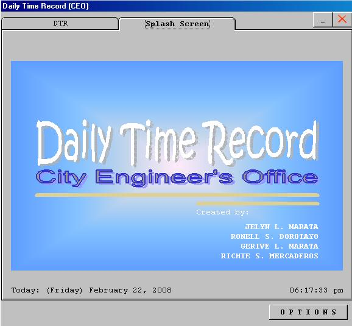



## Payroll System with DTR

### Description

Generates payroll reports all base from DTR and is

use to record the daily time record of an employee.
 
### More Info
 

             |
---                |---
**Submitted On**   |2008-02-20 19:55:48
**By**             |[Richie Mercaderos](https://github.com/Planet-Source-Code/PSCIndex/blob/master/ByAuthor/richie-mercaderos.md)
**Level**          |Beginner
**User Rating**    |3.7 (11 globes from 3 users)
**Compatibility**  |VB 6\.0
**Category**       |[Databases/ Data Access/ DAO/ ADO](https://github.com/Planet-Source-Code/PSCIndex/blob/master/ByCategory/databases-data-access-dao-ado__1-6.md)
**World**          |[Visual Basic](https://github.com/Planet-Source-Code/PSCIndex/blob/master/ByWorld/visual-basic.md)
**Archive File**   |[Payroll\_Sy2102942222008\.zip](https://github.com/Planet-Source-Code/richie-mercaderos-payroll-system-with-dtr__1-70131/archive/master.zip)

